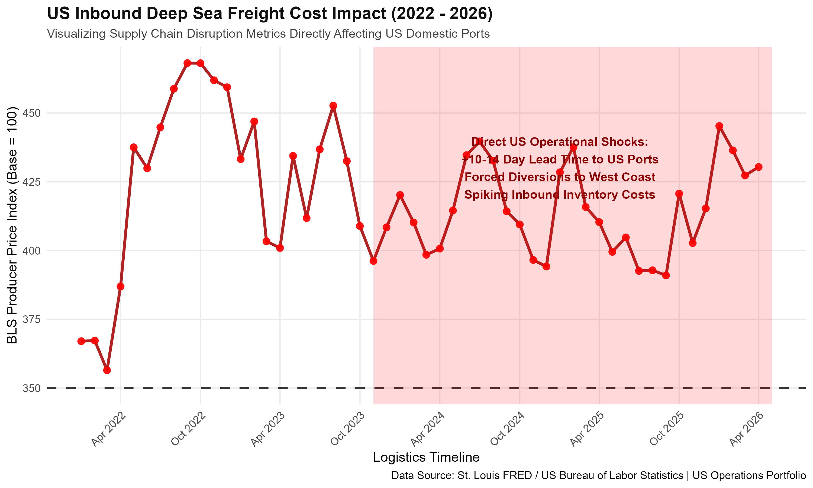

# 📈 Global Supply Chain Risk Dashboard (US Inbound Focus)

## 📌 Executive Product Summary
In global logistics, unexpected maritime bottlenecks directly disrupt material requirements planning (MRP), inflate inventory carrying costs, and delay production timelines. This project serves as an analytical MVP designed for **Supply Chain Operations Leaders** and **Procurement Managers** to monitor real-time shipping rate volatility and flag systemic risks heading toward United States ports.

By ingesting data from the US Bureau of Labor Statistics (BLS), this dashboard isolates macro pricing shocks and translates them into actionable operational insights—helping teams adjust safety stock buffers and dynamically negotiate carrier contracts.

---

## 📊 Visualized US Inbound Logistics Shocks (2022 - 2026)
The visualization below isolates the intense volatility hitting US inbound deep-sea freight lanes. The red alert threshold dynamically flags periods where structural supply line stress threatens domestic retail and manufacturing margins.

---

## 🎯 Deep-Dive Operational Analysis & US Business Impact

### 1. The Middle East Transit Crisis (Late 2023 - Present)
As highlighted by the active red risk corridor on the graph, regional conflicts impacting crucial maritime choke points (such as the Red Sea and the Strait of Hormuz) have severely penalized US-bound shipping lanes:
* **Extended Lead Times:** Ocean carriers bypassing high-risk zones are forced to route around the Cape of Good Hope, adding **10 to 14 days** of transit time for components bound for US East Coast factories.
* **Port Congestion & Diversions:** To avoid prolonged voyages, massive volumes of cargo have been diverted directly to US West Coast ports (LA/Long Beach), creating localized chassis shortages and rail gridlock.
* **Working Capital Trapped:** For a typical US manufacturer, a 2-week inventory delay means capital is trapped on the water longer, driving up safety stock requirements by an estimated **15-20%** to prevent factory stockouts.

### 2. The 350-Index Risk Threshold Breakout
* **Baseline Stress:** The horizontal dashed line at **350** marks the critical risk boundary. When the index breaks above this line, it serves as an early-warning signal that freight spot rates are outstripping historical contract protections.
* **Downstream Price Creep:** Historically, sustained breakouts above this threshold correlate with a **3-to-6 month lagged increase** in the US Producer Price Index (PPI) for finished consumer goods, as companies pass inbound freight premiums down to the end consumer.

---

## 🛠️ Technical Implementation & Product Architecture
* **Data Pipeline:** Automated HTTP CSV ingestion from the St. Louis FRED API (Series: `PCU483111483111`).
* **Wrangling & Optimization:** Constructed using **R (v4.4.1)** and `tidyverse` to clean irregular string dates into `Date` objects, remove missing database records, and isolate the current post-2022 timeline.
* **Visualization Engine:** Standardized through custom `ggplot2` layering, utilizing rotated geometric labels (`angle = 45`) to optimize mobile and desktop readability.

---

## 🏃‍♂️ Agile Product Management Backlog
This product is managed using Scrum frameworks to ensure iterative value delivery. Below is the active sprint roadmap for the engineering squad:

| Sprint | Item ID | Feature Name | Description / Target Value | Status |
| :--- | :--- | :--- | :--- | :--- |
| **Sprint 1** | US-01 | Date Range Filtering | Slice data to focus strictly on current ongoing eras (2022-2026). | **Done** |
| **Sprint 1** | US-03 | Visual Risk Thresholds | Draw horizontal alert baselines and highlight outlying data spikes. | **Done** |
| **Sprint 2** | US-02 | Interactive HTML Tooltips | Transition static plots to interactive `plotly` charts for precise coordinate hover. | *Todo* |
| **Sprint 2** | US-04 | Multi-Series Energy Ingestion | Plot Global Bunker Fuel Prices alongside shipping rates to map cost drivers. | *Todo* |

---

## 🛠️ Data Infrastructure & Back-End Architecture (SQL)

To power high-visibility operational dashboards, raw transactional logistics tables must be transformed into clean, optimized analytical data layers. 

I engineered a production-grade optimization script found directly in [`warehouse_lead_time_analytics.sql`](./warehouse_lead_time_analytics.sql) utilizing advanced SQL strategies to process shipping milestones:

* **Multi-Layered Common Table Expressions (CTEs):** Built to isolate metrics and maintain high-performance query execution by separating initial delta tracking from window partitioning logic.
* **Analytical Window Functions (`AVG() OVER`):** Calculates a rolling 5-shipment moving average delay index partitioned by specific vendors. This allows the product to differentiate between a random transit anomaly and a structural supplier bottleneck.
* **Forward-Looking Cost Projections (`LEAD()`):** Measures pricing volatility and trends by matching current container shipment costs against the next scheduled lane asset.
* **Conditional Risk Categorization (`CASE WHEN`):** Implements automated warehouse alert flags (`CRITICAL DELAY`, `WARNING`, `OPTIMIZED`) to feed live visualization alerts when lead-time variances breach risk thresholds.